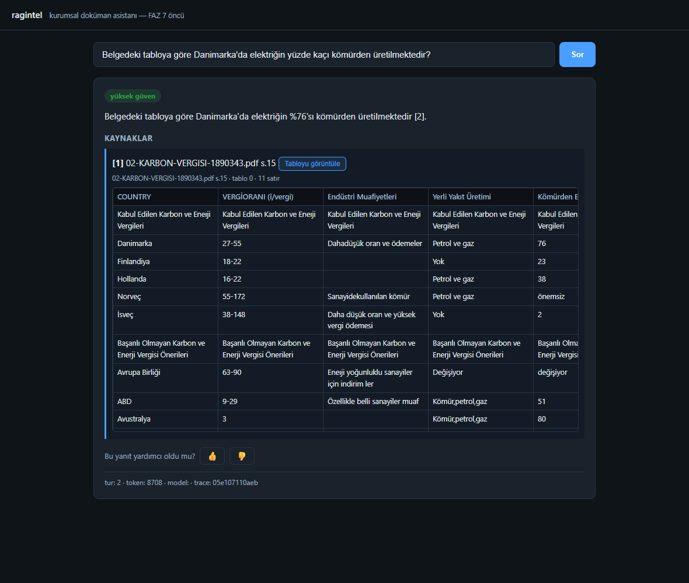

# M-2 — Yapısal Tablo Gösterimi (Kapanış Raporu)

**Durum:** Kod + test + canlı kabul tamamlandı. Kaynak panelindeki tablo-kökenli
citation'lar artık `jsonb`'den **gerçek HTML tablo** olarak render ediliyor; M-1 ile
bölünmüş tablolarda alıntının geldiği **satır aralığı vurgulanıyor**.

**Ön-veri kontrolü tasarımın dayandığı varsayımı çürüttü:** şemada chunk→tablo bağlantısı
YOK. Bağlantı iki yoldan türetildi (bkz. §2); kalıcı kolon **M-2b**'ye alındı (§6).

---

## 1. Ön-veri kontrolü (kod öncesi)

### 1a. Doğrudan soru: `table_data` dolu/parse-edilebilir mi?

**Cevap: 173/173 — beklenti karşılandı.** Yapısal bozukluk **sıfır**:

| Kontrol | Sonuç |
|---|---|
| Toplam `core_tables` kaydı | 173 |
| `table_data IS NULL` | 0 |
| Boş payload (`{}` / `[]` / `null`) | 0 |
| `jsonb_typeof = 'array'` | 173 |
| Satır olmayan iç öğe | 0 |
| Ragged (satır genişliği tutarsız) tablo | 0 |

Yani "`table_data` parse edilemiyorsa metin-quote'a düş" fallback'i **hiçbir zaman
tetiklenmeyecek**. Buna rağmen kodda korundu (savunma; `renderable:false`).

### 1b. Beklenmeyen bulgu — chunk→tablo bağlantısı şemada yok (BLOKER)

`core_chunks`'ta `table_id` kolonu yok; Python kaynağında `table_id` hiç geçmiyor ve
`is_table` **bilinçli olarak persist edilmiyor**
([chunk.py](../ragintel/ingestion/chunking/chunk.py): *"`is_table` yalnızca dahili
(persist edilmez)"*). "Chunk tablo-kökenli mi?" sorusu DB'de doğrudan cevaplanamıyor.

M-1'in `section_title`'a yazdığı `tablo{N} · satır A-B` **tek iz** — ama yalnız eşik-üstü
bölünmüş tablolarda var: 1290 chunk'ın **138**'i, 173 tablonun **21**'i.

> **Kritik:** 5 `table_based` golden sorunun (gs-v0-027..031) **hiçbiri** bölünmüş tabloya
> düşmüyor; kanıt chunk'larının `section_title`'ı ya düz metin başlığı ya `None`.
> Yalnız `section_title`'a dayanan bir tasarım kabul kriterindeki golden soru için
> **sıfır tablo** render ederdi.

### 1c. Semantik bozukluk — 23 tabloda başlık tamamen yer tutucu

23 tablonun **başlık satırının tamamı** `<!-- rich cell -->` (Docling'in zengin/birleşik
hücre yer tutucusu). Bunlar **jsonb olarak geçerli** — yani "parse edilemezse fallback"
mantığı bunları YAKALAMAZ; UI kolon adı olarak `<!-- rich cell -->` basardı. Ayrı bir
semantik kontrol gerekti (§3, `headerless`).

Hepsi `.docx` kaynaklı ve hepsi `default` scope'ta (**envanter scope'unda 0** → GGB demo'su
etkilenmiyor):

| table_id | dosya | tablo indeksi | satır |
|---|---|---|---|
| 699, 700 | 001.docx | 0, 1 | 5, 5 |
| 705, 706, 707 | 002.docx | 0, 1, 2 | 13, 10, 13 |
| 708, 709 | 003.docx | 0, 1 | 5, 5 |
| 710, 711, 712, 713, 714 | 004.docx | 0–4 | 5, 4, 4, 4, 3 |
| 754–764 (11 tablo) | RAG_Project_Doc.docx | 0–10 | 17, 2, 4, 8, 5, 8, 5, 3, 7, 3, 5 |

### 1d. İkincil bulgular

- **10 mükerrer payload** (2 grup; ör. 699/700 birebir aynı) → tie-break `min(table_id)`.
- **18 tablo tek satırlı** (yalnız başlık, gövde yok) → render edilir, gövde boş.
- **10 tablo hiç chunk üretmemiş** (`table_text` boş, 1 satır; chunker `[]` döner) →
  citation olarak **asla görünemezler**, dolayısıyla linkage kapsamı dışı kalmaları zararsız.

---

## 2. Chunk→tablo bağlantısı: iki yollu türetme

| Yol | Mekanizma | Kapsam | Satır aralığı |
|---|---|---|---|
| **A** | `section_title` regex `^tablo(\d+) · satır (\d+)(?:-(\d+))?$` → `(file_id, table_index)` | 21 tablo | ✅ (M-1 vurgusu) |
| **B** | `chunk_text = table_text` birebir eşitliği | 142 tablo | ❌ (tam tablo) |

Örtüşme 0 (bölünmüş tablonun birebir chunk'ı olmaz). **163 tablo çözümleniyor** —
alıntılanabilir tabloların **%100'ü** (kalan 10, §1d gereği hiç chunk üretmemiş).

**Yol B kırılgan:** metin eşitliğine dayanır; cleaning/flatten davranışı değişirse
**sessizce** kopar. Bunu mühürleyen kanarya testi bugün eklendi:
`tests/test_faz_m2_table_view.py::test_path_b_equality_join_still_resolves` — eşleşen chunk
kalmazsa kırmızı yanar. Kalıcı çözüm **M-2b** (§6).

---

## 3. Ne yapıldı (kod)

- **[table_repo.py](../ragintel/database/table_repo.py)** (yeni, salt-okunur):
  - `resolve_table_refs(conn, chunk_ids)` — tek sorguda Yol A + Yol B; mükerrerde `min(table_id)`.
  - `normalize_table_data(raw)` — `<!-- rich cell -->` ve NBSP temizliği; başlık temizlendikten
    sonra **tamamen boşsa** `headerless=True` + jenerik `Kolon N` başlığı. **Hiçbir gövde satırı
    başlığa terfi ettirilip yutulmaz.** Beklenmedik şekil → `ValueError`.
  - `get_table_for_scopes(conn, table_id, scopes)` — **fail-closed**: scope dışı VE var olmayan
    tablo **aynı** `None`'ı döner.
- **[schemas.py](../ragintel/api/schemas.py)** — `TableRef` modeli + `Source.table_ref` (**additive**,
  varsayılan `None`; `extra='forbid'` şemaya bilinçli eklendi — `reviewed_sources` ile aynı gerekçe).
- **[runtime.py](../ragintel/api/runtime.py)** — `_enrich_table_refs()` (`sources` + `meta.reviewed_sources`);
  çözümleme hatası `/api/ask`'i **çökertmez** (log + zenginleştirmeden döner). `table()` uç metodu.
- **[app.py](../ragintel/api/app.py)** — `GET /api/table/{table_id}`; Bearer **zorunlu**;
  scope dışı → **404** (403 DEĞİL — 403 tablonun varlığını sızdırırdı).
- **[index.html](../ragintel/api/static/index.html)** — tablo-kökenli citation'da "Tabloyu görüntüle";
  `jsonb`'den HTML tablo; M-1 alt-chunk'ında satır vurgusu; `renderable:false` / 404 / ağ hatasında
  **metin-quote fallback** (kırılmaz). Tablo-olmayan kaynakta düğme **yok** → görünüm aynen eski.

**CSS notu:** ilk render'da tek bir uzun hücre (`NOT: Bütün vergi oranları…`) ilk kolonu şişirip
alıntının geldiği 5. kolonu ekran dışına itiyordu. `width:max-content` + hücre sarması
(`max-width:180px`) ile düzeltildi — kabul ekran görüntüsünde 5 kolonun tamamı görünür.

---

## 4. Kabul kanıtı (canlı)

Canlı sunucu (`:8099`, `db/ollama/tei = ok`), geçici kullanıcılar (`m2-default` → `[default]`,
`m2-envanter` → `[envanter]`); **kabul sonrası ikisi de silindi ve doğrulandı**.

### 4a. Golden `table_based` soru → gerçek tablo (gs-v0-029)

Soru: *"Belgedeki tabloya göre Danimarka'da elektriğin yüzde kaçı kömürden üretilmektedir?"*
→ `confidence=high`, cevap **%76**, citation `chunk=46902` → `table_ref={table_id:742}` (Yol B).



Tablo `02-KARBON-VERGISI-1890343.pdf` s.15'ten, 11 satır × 5 kolon.
`Danimarka | 27-55 | Dahadüşük oran ve ödemeler | Petrol ve gaz | **76**` satırı görünür —
golden `gold_evidence` ile birebir.

### 4b. Alt-chunk satır vurgusu (GGB envanteri, M-1 bölünmüş)

> **Ekran görüntüsü BİLEREK yok.** GGB sunucu envanteri hassastır (gerçek sunucu adı, iç IP,
> sürüm bilgisi) ve `.gitignore` `raw_files/` + `var/` ile bu veri sınıfını repo dışında
> tutar. Ekran görüntüsü aynı veriyi görüntü olarak taşıyacağı için commit **edilmedi**;
> kanıt metinsel ve testle mühürlü
> (`test_faz_m2_table_view.py::test_path_a_subchunk_resolves_table_and_row_range`).

Envanter scope'lu bir sunucu-performans sorusu (`envanter` scope'lu kullanıcı) →
citation `chunk=59640`, `section='tablo1 · satır 1-15'` →
`table_ref={table_id:1029, row_start:1, row_end:15}`.

UI'da canlı doğrulanan davranış: 71 satır × 6 kolon tablo render edildi; **gövde satırı 1–15
vurgulandı** (DOM'da 15 adet `tr.hl` sayıldı); alıntının geldiği satırlar vurgulu blokta;
altyazı: *"Alıntının geldiği satırlar vurgulandı: gövde satırı 1–15"*.

Tablo render'ının kendisini §4a'daki golden ekran görüntüsü (kamuya açık karbon-vergisi
korpusundan) zaten kanıtlıyor; §4b'nin eklediği tek şey satır-aralığı vurgusu ve o da
yukarıdaki sayım + test ile doğrulanmış durumda.

### 4c. Scope fail-closed

| İstek | Kullanıcı | Sonuç |
|---|---|---|
| `GET /api/table/742` | `m2-default` | **200** |
| `GET /api/table/1024` (envanter) | `m2-default` | **404** `{"detail":"Tablo bulunamadı"}` |
| `GET /api/table/99999999` (yok) | `m2-default` | **404** `{"detail":"Tablo bulunamadı"}` |
| `GET /api/table/1024` | `m2-envanter` | **200** |
| `GET /api/table/742` | Bearer yok | **401** |

Scope dışı ve var olmayan tablonun yanıtları **birebir aynı** → varlık bilgisi sızmıyor.
Yetkili kullanıcının 200 alması, 404'ün gerçekten scope kaynaklı olduğunu kanıtlar.

### 4d. Regresyon — tablo-olmayan kaynaklar

*"Karbon vergisinin amacı nedir?"* → 5 kaynak, **hepsinde `table_ref=None`** → düğme çıkmaz,
kaynak paneli davranışı **değişmedi**. `table_ref` anahtarı her kaynakta mevcut (additive kontrat).

### 4e. Testler

- `tests/test_faz_m2_table_view.py` — **13/13** (kontrat/additive, normalizasyon + jenerik başlık,
  Yol A satır aralığı, **Yol B kanaryası**, tablo-olmayan chunk, mükerrer determinizmi,
  scope fail-closed repo + uç nokta, 401, payload şekli).
- Tam süit (`-m "not slow"`): **304 passed** (M-2 öncesi 291 + 13 yeni).

> **Dürüstlük notu:** tam süitin bir koşusunda `test_ip10_orchestrator::test_end_to_end_corpus_completed`
> düştü. İzole ve sonraki üç tam koşuda geçti. Bu test `_status_counts(live_db) == {"COMPLETED": n}`
> ile **scope geneli** sayım doğruluyor; paylaşılan DB'de önceki kısmi koşulardan kalan kayıtlara
> duyarlı. M-2 DB'ye **hiçbir şey yazmaz** (`table_repo` yalnızca `SELECT`) → mevcut bir kırılganlık,
> M-2 regresyonu değil.

---

## 5. Kapsam dışı gözlemler (bu commit'te düzeltilmedi)

1. **`envanter` kullanıcısının scope'u `['inventory']`**, oysa dokümanların `doc_scope`'u
   `'envanter'`. Bu kullanıcı envanter belgelerini **hiç göremiyor**. Veri/config uyumsuzluğu.
2. Cevap metnindeki citation numaraları (`[2]`, `[1][3]`) ile kaynak listesi numaralandırması
   (`[1]..[n]`) örtüşmüyor — `compose._sources` citation'ları 1'den yeniden numaralandırıyor.
3. FAZ 6 PII maskeleme, SQL Server ürün sürümünü tarih sanıp `[TARİH].9`'a maskeliyor.

---

## 6. M-2b — kalıcı `table_id` + `row_range` kolonu (BACKLOG, sonraki re-ingest turunda)

**İş kalemi adı:** `M-2b: kalıcı table_id + row_range kolonu — sonraki re-ingest turunda`

**Neden:** Yol B (`chunk_text = table_text`) metin eşitliğine dayanır; cleaning/flatten
değişirse sessizce kopar (bugün kanarya testiyle sesli hale getirildi).

**Ne yapılacak:**

```sql
ALTER TABLE core_chunks
    ADD COLUMN table_id        bigint REFERENCES core_tables(table_id) ON DELETE SET NULL,
    ADD COLUMN table_row_start int,
    ADD COLUMN table_row_end   int;
CREATE INDEX IF NOT EXISTS idx_core_chunks_table ON core_chunks (table_id);
```

- `chunker._table_chunks` alt-chunk'ta `table_index` + satır aralığını `Chunk`'a taşısın;
  `storage_repo._CHUNK_COLS`'a eklensin (`is_table` de persist edilebilir).
- Tüm korpus re-ingest → `table_repo.resolve_table_refs` gövdesi tek `JOIN`'e iner.
- **API kontratı DEĞİŞMEZ** (`Source.table_ref` aynı) — yalnız çözümleyicinin içi değişir.
- Yol B kanaryası o zaman silinebilir.
